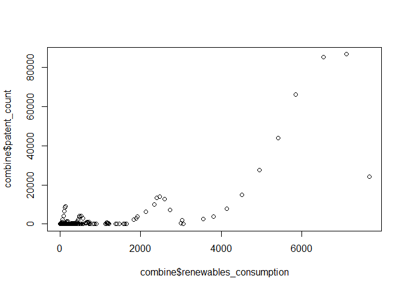

Untitled
================

Preparation

``` r
library(dplyr)
```

    ## 
    ## Attaching package: 'dplyr'

    ## The following objects are masked from 'package:stats':
    ## 
    ##     filter, lag

    ## The following objects are masked from 'package:base':
    ## 
    ##     intersect, setdiff, setequal, union

# Artificial Intelligence and Energy

Before we begin, we need to import the relevant datasets, here is one
for the energy consumption:

``` r
energy <- read.csv("energy_data.csv")
energy <- energy %>% select(!contains(c("change", "share", "per_capita"), ignore.case = FALSE)) %>% filter(iso_code != "")
head(energy)
```

    ##       country year iso_code population gdp biofuel_consumption
    ## 1 Afghanistan 1900      AFG    4707744  NA                  NA
    ## 2 Afghanistan 1901      AFG    4751177  NA                  NA
    ## 3 Afghanistan 1902      AFG    4802500  NA                  NA
    ## 4 Afghanistan 1903      AFG    4861833  NA                  NA
    ## 5 Afghanistan 1904      AFG    4921891  NA                  NA
    ## 6 Afghanistan 1905      AFG    4982681  NA                  NA
    ##   biofuel_electricity carbon_intensity_elec coal_consumption coal_electricity
    ## 1                  NA                    NA               NA               NA
    ## 2                  NA                    NA               NA               NA
    ## 3                  NA                    NA               NA               NA
    ## 4                  NA                    NA               NA               NA
    ## 5                  NA                    NA               NA               NA
    ## 6                  NA                    NA               NA               NA
    ##   coal_production electricity_demand electricity_generation energy_per_gdp
    ## 1               0                 NA                     NA             NA
    ## 2               0                 NA                     NA             NA
    ## 3               0                 NA                     NA             NA
    ## 4               0                 NA                     NA             NA
    ## 5               0                 NA                     NA             NA
    ## 6               0                 NA                     NA             NA
    ##   fossil_electricity fossil_fuel_consumption gas_consumption gas_electricity
    ## 1                 NA                      NA              NA              NA
    ## 2                 NA                      NA              NA              NA
    ## 3                 NA                      NA              NA              NA
    ## 4                 NA                      NA              NA              NA
    ## 5                 NA                      NA              NA              NA
    ## 6                 NA                      NA              NA              NA
    ##   gas_production greenhouse_gas_emissions hydro_consumption hydro_electricity
    ## 1              0                       NA                NA                NA
    ## 2              0                       NA                NA                NA
    ## 3              0                       NA                NA                NA
    ## 4              0                       NA                NA                NA
    ## 5              0                       NA                NA                NA
    ## 6              0                       NA                NA                NA
    ##   low_carbon_consumption low_carbon_electricity net_elec_imports
    ## 1                     NA                     NA               NA
    ## 2                     NA                     NA               NA
    ## 3                     NA                     NA               NA
    ## 4                     NA                     NA               NA
    ## 5                     NA                     NA               NA
    ## 6                     NA                     NA               NA
    ##   nuclear_consumption nuclear_electricity oil_consumption oil_electricity
    ## 1                  NA                  NA              NA              NA
    ## 2                  NA                  NA              NA              NA
    ## 3                  NA                  NA              NA              NA
    ## 4                  NA                  NA              NA              NA
    ## 5                  NA                  NA              NA              NA
    ## 6                  NA                  NA              NA              NA
    ##   oil_production other_renewable_consumption other_renewable_electricity
    ## 1             NA                          NA                          NA
    ## 2             NA                          NA                          NA
    ## 3             NA                          NA                          NA
    ## 4             NA                          NA                          NA
    ## 5             NA                          NA                          NA
    ## 6             NA                          NA                          NA
    ##   other_renewable_exc_biofuel_electricity primary_energy_consumption
    ## 1                                      NA                         NA
    ## 2                                      NA                         NA
    ## 3                                      NA                         NA
    ## 4                                      NA                         NA
    ## 5                                      NA                         NA
    ## 6                                      NA                         NA
    ##   renewables_consumption renewables_electricity solar_consumption
    ## 1                     NA                     NA                NA
    ## 2                     NA                     NA                NA
    ## 3                     NA                     NA                NA
    ## 4                     NA                     NA                NA
    ## 5                     NA                     NA                NA
    ## 6                     NA                     NA                NA
    ##   solar_electricity wind_consumption wind_electricity
    ## 1                NA               NA               NA
    ## 2                NA               NA               NA
    ## 3                NA               NA               NA
    ## 4                NA               NA               NA
    ## 5                NA               NA               NA
    ## 6                NA               NA               NA

…and here is one for AI patents (which we use as a proxy of how
AI-intensive a country is):

``` r
patent <- read.csv("ai_patents.csv")
patent <- patent %>% rename(patent_count = Patent.applications...Field..All)
head(patent)
```

    ##      Entity Code Year patent_count
    ## 1 Argentina  ARG 2013            1
    ## 2 Argentina  ARG 2016            1
    ## 3 Argentina  ARG 2017            1
    ## 4 Argentina  ARG 2018            7
    ## 5 Argentina  ARG 2019            8
    ## 6 Argentina  ARG 2020           10

Obviously, we need to merge them in some way. This is what we have done.

``` r
energy <- energy %>% group_by(country, year) %>% mutate(combinekey = paste(iso_code,toString(year)))
patent <- patent %>% group_by(Code, Year) %>% mutate(combinekey = paste(Code,toString(Year)))
combine <- inner_join(patent, energy, by = c("combinekey")) %>% select(-Year, -iso_code, -country, -combinekey)
```

    ## Adding missing grouping variables: `Year`

``` r
head(combine)
```

    ## # A tibble: 6 × 42
    ## # Groups:   Code, Year [6]
    ##    Year Entity   Code  patent_count  year population     gdp biofuel_consumption
    ##   <int> <chr>    <chr>        <int> <int>      <dbl>   <dbl>               <dbl>
    ## 1  2013 Argenti… ARG              1  2013   42388268 8.49e11               11.9 
    ## 2  2016 Argenti… ARG              1  2016   43668236 8.33e11               16.0 
    ## 3  2017 Argenti… ARG              1  2017   44054616 8.56e11               18.4 
    ## 4  2018 Argenti… ARG              7  2018   44413592 8.34e11               17.6 
    ## 5  2019 Argenti… ARG              8  2019   44745516 8.17e11               18.0 
    ## 6  2020 Argenti… ARG             10  2020   45036032 7.36e11                9.65
    ## # ℹ 34 more variables: biofuel_electricity <dbl>, carbon_intensity_elec <dbl>,
    ## #   coal_consumption <dbl>, coal_electricity <dbl>, coal_production <dbl>,
    ## #   electricity_demand <dbl>, electricity_generation <dbl>,
    ## #   energy_per_gdp <dbl>, fossil_electricity <dbl>,
    ## #   fossil_fuel_consumption <dbl>, gas_consumption <dbl>,
    ## #   gas_electricity <dbl>, gas_production <dbl>,
    ## #   greenhouse_gas_emissions <dbl>, hydro_consumption <dbl>, …

In summary, what we have done is as follows: - Only considered countries
with an ISO code (meaning no regionals) - Merged the data between the
energy consumption and the patent data for each country and each year

Of course, we can do further consolidation as we go along.

**A warning about our observations**

Like many real-world data, we ARE looking at an unbalanced dataset.

``` r
combine %>% group_by(Code) %>% count(Code)
```

    ## # A tibble: 69 × 2
    ## # Groups:   Code [69]
    ##    Code      n
    ##    <chr> <int>
    ##  1 ARG       7
    ##  2 AUS      10
    ##  3 AUT       9
    ##  4 AZE       1
    ##  5 BEL       8
    ##  6 BGR       6
    ##  7 BRA       9
    ##  8 BRN       1
    ##  9 CAN      10
    ## 10 CHE       8
    ## # ℹ 59 more rows

``` r
combine %>% group_by(Year) %>% count(Year)
```

    ## # A tibble: 11 × 2
    ## # Groups:   Year [11]
    ##     Year     n
    ##    <int> <int>
    ##  1  2013    38
    ##  2  2014    39
    ##  3  2015    44
    ##  4  2016    51
    ##  5  2017    51
    ##  6  2018    53
    ##  7  2019    50
    ##  8  2020    49
    ##  9  2021    47
    ## 10  2022    31
    ## 11  2023    11

So what now?

BLAH BLAH BLAH

# Our Hypotheses

In total, we have three hypotheses to test out, as taken from the
perception of the general public.

## Is it really true that having more AI use will lead to more reusable energy???

Ah yes, AI is technically an energy guzzler, all using up large amount
of energy…

REMINDER: This is an example analysis!!! Change if you need be!!!

This also takes into account the fixed effects associated with
country!!! Year is also included as a factor!!!

``` r
lmtest <- lm(patent_count ~ net_elec_imports + renewables_consumption + population + gdp + factor(year) + factor(Entity), combine)
summary(lmtest)
```

    ## 
    ## Call:
    ## lm(formula = patent_count ~ net_elec_imports + renewables_consumption + 
    ##     population + gdp + factor(year) + factor(Entity), data = combine)
    ## 
    ## Residuals:
    ##      Min       1Q   Median       3Q      Max 
    ## -20057.2   -328.5     -6.9    273.0  11728.2 
    ## 
    ## Coefficients:
    ##                                Estimate Std. Error t value Pr(>|t|)    
    ## (Intercept)                   2.997e+03  1.192e+03   2.515 0.012360 *  
    ## net_elec_imports              4.539e+01  1.827e+01   2.484 0.013461 *  
    ## renewables_consumption        1.926e+01  2.330e+00   8.268 2.87e-15 ***
    ## population                   -1.485e-04  2.695e-05  -5.508 7.03e-08 ***
    ## gdp                           2.295e-09  8.971e-10   2.559 0.010928 *  
    ## factor(year)2014             -3.420e+02  4.882e+02  -0.701 0.484020    
    ## factor(year)2015             -5.911e+02  4.762e+02  -1.241 0.215351    
    ## factor(year)2016             -8.045e+02  4.656e+02  -1.728 0.084895 .  
    ## factor(year)2017             -8.985e+02  4.693e+02  -1.914 0.056397 .  
    ## factor(year)2018             -9.472e+02  4.667e+02  -2.029 0.043177 *  
    ## factor(year)2019             -9.189e+02  4.720e+02  -1.947 0.052379 .  
    ## factor(year)2020             -5.918e+02  4.947e+02  -1.196 0.232428    
    ## factor(year)2021             -1.051e+03  4.860e+02  -2.162 0.031316 *  
    ## factor(year)2022             -2.636e+03  5.405e+02  -4.877 1.64e-06 ***
    ## factor(Entity)Australia      -3.535e+03  1.272e+03  -2.779 0.005739 ** 
    ## factor(Entity)Austria        -4.955e+03  1.243e+03  -3.986 8.18e-05 ***
    ## factor(Entity)Azerbaijan     -9.540e+02  2.312e+03  -0.413 0.680128    
    ## factor(Entity)Belgium        -2.862e+03  1.322e+03  -2.165 0.031040 *  
    ## factor(Entity)Brazil         -8.877e+03  5.371e+03  -1.653 0.099238 .  
    ## factor(Entity)Bulgaria       -1.549e+03  1.394e+03  -1.111 0.267294    
    ## factor(Entity)Canada         -2.017e+04  2.168e+03  -9.301  < 2e-16 ***
    ## factor(Entity)Chile          -2.182e+03  1.213e+03  -1.799 0.072920 .  
    ## factor(Entity)China           9.819e+04  3.069e+04   3.199 0.001503 ** 
    ## factor(Entity)Colombia        8.820e+02  1.269e+03   0.695 0.487428    
    ## factor(Entity)Croatia        -2.487e+03  1.621e+03  -1.535 0.125760    
    ## factor(Entity)Czechia        -1.211e+03  1.383e+03  -0.876 0.381602    
    ## factor(Entity)Denmark        -3.281e+03  1.282e+03  -2.558 0.010934 *  
    ## factor(Entity)Estonia        -4.684e+02  2.389e+03  -0.196 0.844651    
    ## factor(Entity)Finland        -4.418e+03  1.262e+03  -3.501 0.000523 ***
    ## factor(Entity)France         -2.288e+03  1.621e+03  -1.411 0.159037    
    ## factor(Entity)Germany        -8.283e+03  1.621e+03  -5.108 5.35e-07 ***
    ## factor(Entity)Greece         -2.229e+03  1.231e+03  -1.810 0.071078 .  
    ## factor(Entity)Hong Kong      -2.373e+03  1.535e+03  -1.546 0.123071    
    ## factor(Entity)Hungary        -2.270e+03  1.250e+03  -1.815 0.070320 .  
    ## factor(Entity)India           1.662e+05  3.145e+04   5.284 2.22e-07 ***
    ## factor(Entity)Indonesia       2.779e+04  5.002e+03   5.555 5.51e-08 ***
    ## factor(Entity)Iran            6.873e+03  2.345e+03   2.931 0.003603 ** 
    ## factor(Entity)Ireland        -2.018e+03  1.665e+03  -1.212 0.226353    
    ## factor(Entity)Israel         -1.389e+03  1.308e+03  -1.062 0.288896    
    ## factor(Entity)Italy          -5.939e+03  1.241e+03  -4.784 2.54e-06 ***
    ## factor(Entity)Japan          -1.178e+03  2.091e+03  -0.563 0.573615    
    ## factor(Entity)Latvia         -2.357e+03  1.869e+03  -1.261 0.208194    
    ## factor(Entity)Lithuania      -2.288e+03  1.343e+03  -1.703 0.089422 .  
    ## factor(Entity)Luxembourg     -2.181e+03  1.408e+03  -1.549 0.122169    
    ## factor(Entity)Malaysia       -5.508e+02  1.099e+03  -0.501 0.616424    
    ## factor(Entity)Mexico          8.514e+03  1.882e+03   4.523 8.37e-06 ***
    ## factor(Entity)Morocco         1.869e+03  1.049e+03   1.782 0.075558 .  
    ## factor(Entity)Netherlands    -2.997e+03  1.270e+03  -2.360 0.018835 *  
    ## factor(Entity)New Zealand    -3.879e+03  1.337e+03  -2.902 0.003948 ** 
    ## factor(Entity)Norway         -9.123e+03  1.372e+03  -6.648 1.14e-10 ***
    ## factor(Entity)Peru            2.145e+02  1.182e+03   0.181 0.856099    
    ## factor(Entity)Philippines     1.054e+04  1.971e+03   5.345 1.63e-07 ***
    ## factor(Entity)Poland         -5.459e+02  1.100e+03  -0.496 0.620041    
    ## factor(Entity)Portugal       -2.885e+03  1.262e+03  -2.286 0.022858 *  
    ## factor(Entity)Romania        -1.390e+03  1.194e+03  -1.164 0.245181    
    ## factor(Entity)Russia          1.917e+03  2.119e+03   0.905 0.366329    
    ## factor(Entity)Slovakia       -2.203e+03  1.640e+03  -1.343 0.180065    
    ## factor(Entity)Slovenia       -2.461e+03  1.536e+03  -1.602 0.109987    
    ## factor(Entity)South Africa    4.415e+03  1.102e+03   4.008 7.49e-05 ***
    ## factor(Entity)South Korea     2.803e+03  1.374e+03   2.039 0.042176 *  
    ## factor(Entity)Spain          -4.618e+03  1.032e+03  -4.476 1.03e-05 ***
    ## factor(Entity)Sri Lanka       1.544e+02  2.248e+03   0.069 0.945269    
    ## factor(Entity)Sweden         -6.107e+03  1.328e+03  -4.598 5.98e-06 ***
    ## factor(Entity)Switzerland    -4.219e+03  1.338e+03  -3.152 0.001759 ** 
    ## factor(Entity)Taiwan         -1.464e+03  1.351e+03  -1.084 0.279332    
    ## factor(Entity)Thailand        3.382e+03  2.295e+03   1.474 0.141426    
    ## factor(Entity)Turkey          3.902e+02  1.217e+03   0.321 0.748618    
    ## factor(Entity)Ukraine         3.032e+03  1.076e+03   2.819 0.005087 ** 
    ## factor(Entity)United Kingdom -4.234e+03  1.255e+03  -3.373 0.000826 ***
    ## factor(Entity)United States  -3.389e+04  6.821e+03  -4.968 1.06e-06 ***
    ## ---
    ## Signif. codes:  0 '***' 0.001 '**' 0.01 '*' 0.05 '.' 0.1 ' ' 1
    ## 
    ## Residual standard error: 2043 on 350 degrees of freedom
    ##   (44 observations deleted due to missingness)
    ## Multiple R-squared:  0.9355, Adjusted R-squared:  0.9228 
    ## F-statistic: 73.56 on 69 and 350 DF,  p-value: < 2.2e-16

We then choose to plot something…

``` r
plot1 <- plot(combine$renewables_consumption, combine$patent_count)
```

<!-- -->

That does not look linear… We need to do something else.
